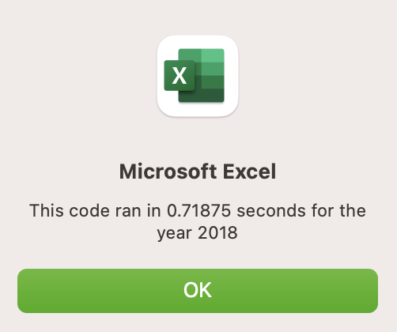

# stock-analysis using VBA
KU Data Analytics Boot Camp, Module 2: VBA of Wall Street
Performing stocks analysis by creating macros in VBA to determine the returns. Also, understanding the importance of refactoring code.

# Overview
1. Create a VBA macro that can trigger pop-ups and inputs, read and change cell values, and format cells.
2. Use for loops and conditionals to direct logic flow.
3. Use nested for loops.
4. Apply coding skills such as syntax recollection, pattern recognition, problem decomposition, and debugging.

## Purpose

For Module 2 challenge in the KU Data Analytics Boot Camp, we helped Steve perform stock analysis to determine the stock returns and if he should invest or not. The main purpose of the challenge is to refactor the original VBA code to loop only once, and determine if the changes made decreased the run time of the VBA code thus increased it efficiency. 

Using the run buttons created using VBA, Steve should be to input the year into the popup input box. The VBA code uses a timer, arrays, if-then conditional statements, assigns long or string data types, and adds conditional formatting.

# Results
## Comparing 2017 and 2018 Stock Analysis

Comparing the stock results from 2017 and 2018, we see the difference in the total daily volume between 2018 and 2017 that results in less than $100,000,000 in increased volume and it was not enough to produce a positive 2018 return percentage. The ENPH and RUN tickers are considered great investments as they had positive returns in 2018 and both had an increase larger than $200,000,000 through the 2017 total daily volumes.

## Comparing the Original Run Times to the Refactored Run Times

Run times for the original code took 0.78 and 0.71 seconds.

Run times for the refactored code took around .15 seconds.

The refactored code greatly decreased the runtimes of the VBA code and increased it efficiency (optimized it).

## What was the difference in the codes?

There was nested for loops in the original code. That are included in the outer loop and furthermore it output the data for the current date which results in large number of iterations.

Compared to the original code, the refactored code only has one loop and moving the output to a separate loop thus decreased the number of iterations significantly.

# Summary
## 1. What are the advantages or disadvantages of refactoring code?
### Advantages

Refactoring can optimize the code efficiency like we have seen in the challenge, also it can help figure out and debug the VBA code. In refactoring, duplicated subroutines, unnecessary loops, redundant statements or simply a faulty code can be removed and debugged. Another advantage when refactoring codes is that looking at the code from a fresh perspective might provide a chance to improve the code.

### Disadvantages

Different programers have different approaches to write codes, and programmers have different logics sometimes this requires testing of the different approaches taken to determine which code is better which can consume effort and time. Refactoring an existing code might possibly introduce other bugs into the code and results in further issues. It can sometimes be challenging to determine weather to start a new code or refactor and existing one.
  
## 2. How do these pros and cons apply to refactoring the original VBA script?
We have seen that the refactored code reduced the number of loop required thus decreased the processing memory needed for processing the stocks data. This optimized the VBA code which can be observed as the runtime between the original and refactored code significantly decreased. To refactor the VBA code testing must be done to determine if the efficiency has improved or not.
